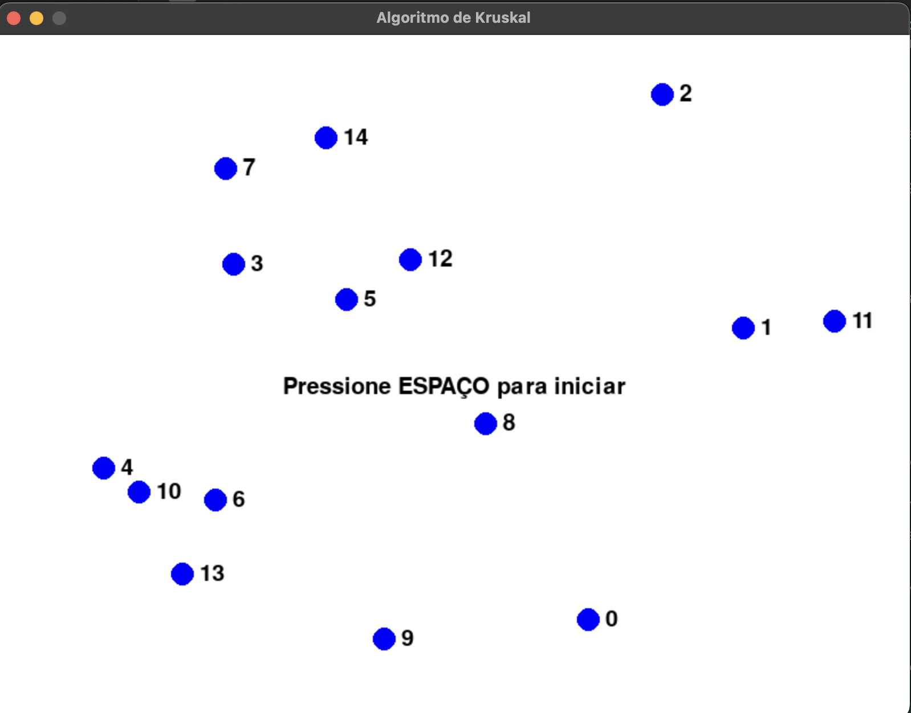
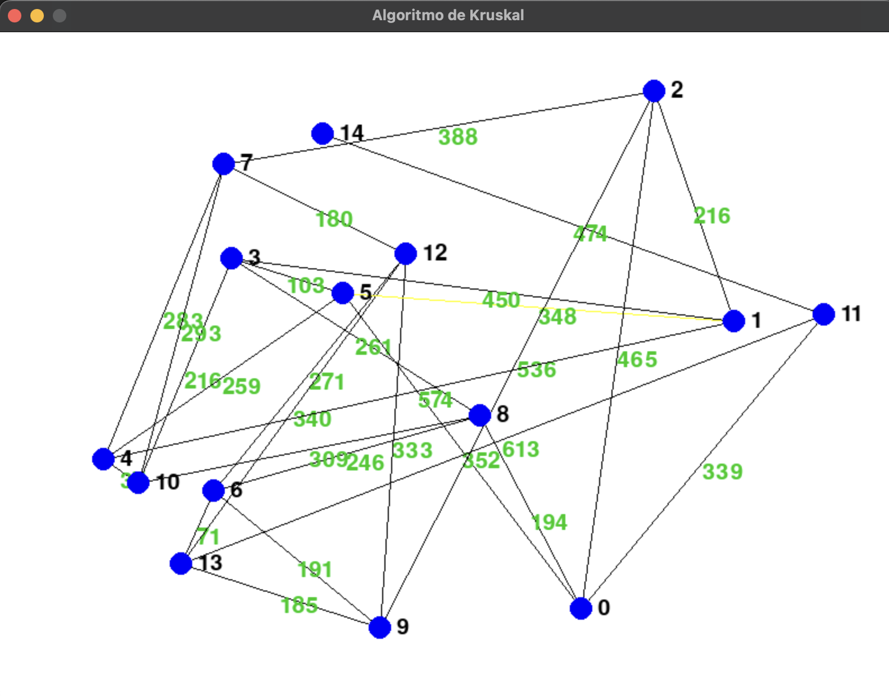
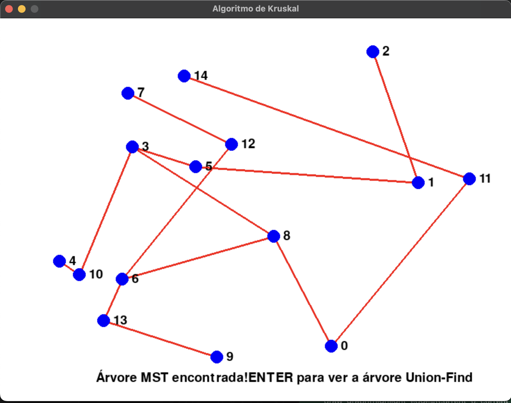
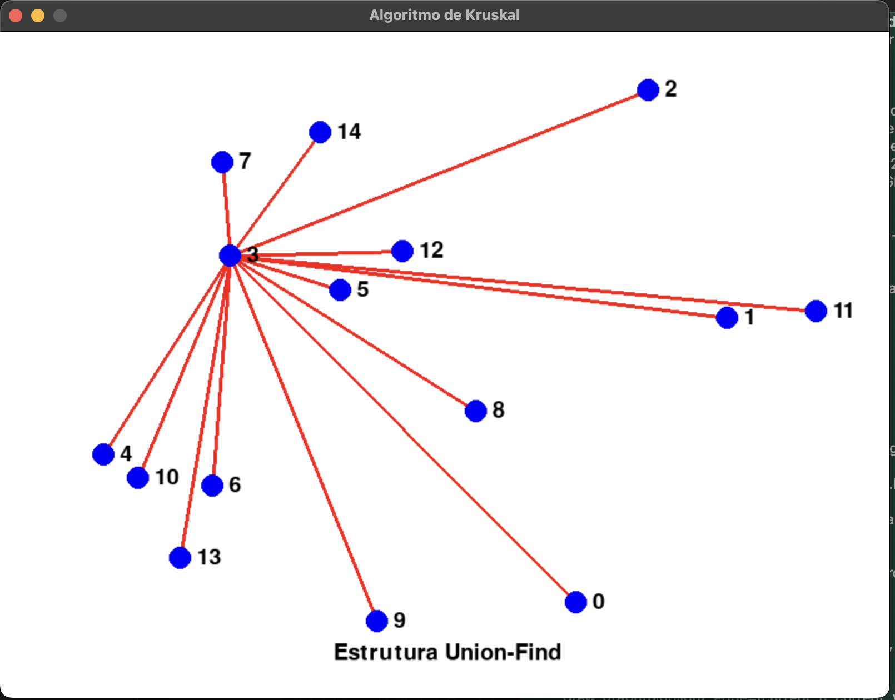

# Greed_MostrandoKruskal

**Número da Lista**: 21 
**Conteúdo da Disciplina**: Greed 

## Alunos
|Matrícula | Aluno |
| -- | -- |
| 20/0038028  |  Guilherme Evangelista Ferreira dos Santos |
| 16/0147816  |  Vinicius Edwardo Pereira Oliveira |

## Sobre 
Fizemos um programa mostrando como funciona o algortimo de kruskal e a estrutura union-find utilizando o pygame

## Screenshots
Inicio

Algoritmo executando 

MST gerada

Union-Find

## Instalação 
**Linguagem**: Python 
**Framework**: Biblioteca pygame 
Deve ter o python e baixar a biblioteva pygame em seu módulo.

## Uso 
Execute o código utilizando o comando python , após abrir o pygame aperte espaço para rodar o algoritmo de kruskal , após ele achar a MST aperte enter para mostrar a estrutura union-find

## Outros 
Link para o vídeo https://youtu.be/ikGvmq5yA_A

